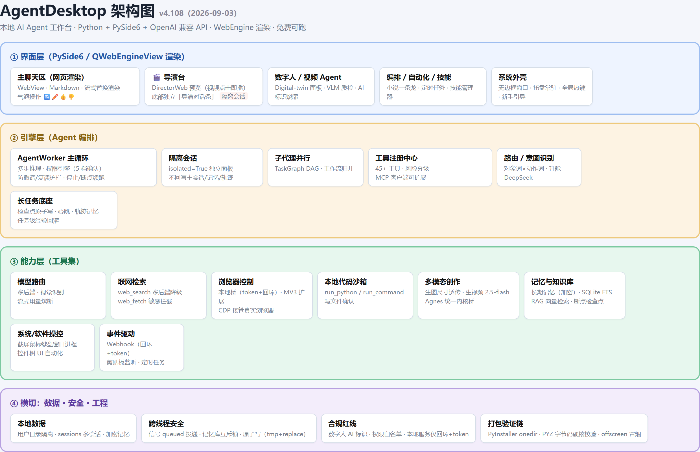

# AgentDesktop

一个常驻 Windows 桌面的**本地 AI Agent 工作台**：系统托盘常驻 + 全局快捷键一键呼出 + 多步推理 Agent 循环 + 45+ 内置工具 + 多模型智能路由 + MCP 可扩展。

技术栈：**Python + PySide6 + OpenAI 兼容 API + Chroma 向量库**，配合 pyautogui / pywinauto 做系统与软件自动化。免费可跑、代码可改可练手。

> 当前版本 **v4.108**。本项目由个人桌面助手迭代而来，经脱敏后开源，供学习参考与二次开发。

---

## 系统架构



四层结构：**界面层**（聊天区 WebEngine 网页渲染 + 导演台独立对话条 + 各功能面板）→ **引擎层**（AgentWorker 主循环 + 权限引擎 + 隔离会话 + 子代理并行 + 长任务检查点）→ **能力层**（45+ 工具：联网/浏览器/代码/系统操控/多模态/记忆知识库）→ **横切层**（本地数据、跨线程安全、合规红线、打包验证链）。

---

## 版本更新

- **v4.108**（2026-09-03）：**全面代码审查后的稳定性大扫除**——第三方对 v4.107 逐行审查（61 项问题），本轮按严重程度全部处理：
  - **Agent 核心**：修复「工具消息配对断裂」导致的会话反复 HTTP 400（工作流早退/并发停止/护栏三路补齐回执）；断点续跑真正可恢复（检查点原子写 + 每步消息快照 + 心跳）；续跑不再丢高级模型开关；内部督促/防撒谎指令不再污染会话历史。
  - **界面与交互**：气泡操作按钮（重新生成/改写/点赞/点踩）全面复活；全局热键、无边框缩放（高分屏）、关窗不再挂死；**聊天渲染状态机重构**——回答落地不再整页重排（运行中工具卡不丢）、工具卡 id 全局唯一（多轮/并发不串卡）、流式不再产生同段双气泡。
  - **导演台**：失败如实报错；合成中途可点停止；角色修改意见只保留最新一条；全部重生成即时刷新；并发指令互斥。
  - **数据与安全**：记忆库并发加锁；会话 ID 防覆盖；config/检查点原子保存；会话文件体积控制；Webhook 默认仅本机回环 + token 校验 + 请求体限长；浏览器工具链中文乱码与跨盘符崩溃修复；浏览器扩展源码随包分发。
- **v4.107**（2026-09-02）：**导演台全面对话化**——像 Pavo 一样用「导演 Agent」在对话框指挥整个视频创作：导演台底部**独立对话条**（与主聊天零交集：不回写主会话/不污染记忆/只挂 5 个导演白名单工具），可精确指挥改某一镜关键帧、换某人物三视图、整镜重生成、合成成片；对话历史跟随项目存档、可清空重来。四个预览容器网页化（视频点击即播、图片灯箱、`localres://` 秒开）；生图/视频模型升级 2.5-flash（尺寸档位 + 无 ASR 乱码字幕）。
- **v4.106**（2026-09-02）：对话框指挥导演台的 5 个工具（查状态 / 改分镜 / 重生成关键帧 / 重生成三视图 / 合成），普通对话按对象词×动作词自动路由进导演工具。
- **v4.105**（2026-09-02）：导演台预览区网页渲染重构（自定义 `localres://` scheme 直读本地图片视频，绕开 file:// CORS）。
- **v4.104**（2026-09-01）：聊天区渲染重构——QTextBrowser 换 QWebEngineView（Markdown、流式平滑、气泡圆角、彻底修复重复气泡），冒烟验证基准确立。
- **v4.103**（2026-08-31）：浏览器扩展桥接——本地 `browser_bridge` 服务（仅回环 + token 鉴权）+ MV3 浏览器扩展一键抓网页进对话；`browser_runner --cdp` 可接管用户真实浏览器（继承登录态、不关用户浏览器）。
- **v4.102**（2026-08-29）：两条主线 + 一批稳定性修复。
  - **长任务控制增强**：① **token 预算熔断**——原先只约束步数/轮次、不约束 token 花销，复杂任务自动升舱付费模型后可能无上限消耗；现支持单任务 token 硬上限（默认 200K，设 `0` 即禁用）、达 80% 提前告警、超限自动停止并保留阶段性结果，付费通道可单独设更紧预算。流式接口需 `stream_options.include_usage` 才能拿到真实用量，且对不识别该参数的通道做了 400/404 自动降级重试。
  - **任务退出写回轨迹**：长任务在**所有退出路径**（正常完成 / token 熔断 / 用户停止 / 超时 / 步数耗尽）统一写回一条任务级轨迹（踩坑 + 有效做法），落在独立文件 `agent_traces.json`，供同类任务后续参考，实现「踩过的坑下次不再踩」。与技能级经验库（待审核生效）互补：一个优化工具，一个优化决策。
  - **图像输入链路**：打通「发图让模型真正看图」，自动识别视觉模型、统一图像编码、附件/贴图/拖拽三条路径归一。
  - **稳定性修复**：Agent 收尾保证 `done` 信号必定触发（修复「回答完仍显示工作中、输入框锁死」）；内容创作类任务不再被强制调工具；视频/口播/数字人意图识别改为「对象词 × 动作词」组合判定，修复「生成口播视频」等分开写法的漏判；修复推理模型不支持 `tool_choice` 导致的 400 空响应。
- **v4.101**（2026-08-21）：停止按钮 + 断点续传——Agent 任务可随时停止并保留检查点，输入区出现「继续上次任务」入口，重开会话自动提示续跑。
- **v4.100**（2026-08-20）：修复闲聊场景体验问题——① 尊重「不要调用工具 / 纯聊天」等指令，闲聊不再反复调工具；② 收紧 `remember` 触发，仅用户显式要求才写入记忆，避免随口闲聊被刷屏式记录；③ 修复 `remember` 会话节流与 nudge 护栏误触发导致的「已多次尝试」死循环。
- **v4.99**（2026-08-19）：防「假装调工具」撒谎双层修复（路由层强制工具意图走 DeepSeek + 主循环撒谎检测器），并盘点累积能力。
- **v4.98**（2026-08-19）：模型智能路由、长文档分段读取、任务完成通知、敏感文件拦截。

---

## 核心能力

### 🧠 Agent 循环引擎
- 多步推理：LLM 自主决定调用哪条工具链，最多 8 步，边想边做。
- 权限引擎（5 档风险模式）：危险操作（写文件 / 执行命令 / 系统操控）逐个确认，安全工具自动放行，支持并发执行。
- 子代理并行（TaskGraph DAG）：`run_workflow` 可将任务拆成多节点并行跑（如多角度研究），结果归并喂回模型。

### 🔧 45+ 内置工具
- **联网**：`web_search`（多后端自动降级）、`web_fetch`（含敏感文件拦截）
- **文件/代码**：`read_file`（支持长文档分段）、`write_file`、`run_command`、`run_python`
- **知识库**：`rag_index` / `rag_search`（Chroma 本地向量库）、Obsidian 异步冷启动
- **多模态**：`image_gen` / `video_gen` / `analyze_image`（生图、生视频、识图）
- **自动化**：`schedule`、`create/list/delete_automation`（一次性/每日/每周/间隔定时任务）
- **系统操控**（14 个）：截屏、鼠标、键盘、剪贴板、窗口、进程
- **软件操控**（10 个）：应用启动/强杀/聚焦、控件树枚举、UI 自动化
- **浏览器**：`browser_open/read/click/fill`（带确认机制）
- **其他**：邮件发送、数据库增删改查、Webhook 收发、图表生成、系统信息、上下文压缩/摘要
- **记忆**：`remember` / `search_memory`（会话级与长期记忆）
- **技能**：`use_skill` / `create_skill`（技能热插拔 + 待审核队列）

### 🎛️ 多模型 + 智能路由
- 内置预设：DeepSeek、Agnes（永久免费）、硅基流动、智谱 GLM、腾讯混元、魔搭 ModelScope，可自定义任意 OpenAI 兼容端点。
- 智能路由：简单问题走免费模型，命中关键词或消息超长自动升级到复杂模型，复杂模型无 key 自动回退，不中断。

### 🧬 记忆与自进化
- 三层记忆：会话记忆 + 操作经验库（harness，支持版本回滚）+ 长任务轨迹记忆（few-shot 注入）。
- 软自进化：经验库自动沉淀 refine；模型自动创建的技能先进「待审核」目录，人工通过后才生效。

### ⚙️ 工程韧性
- 长任务断点续跑 + 心跳 + 自动重试（崩了能续，卡了会换写法重试）。
- 任务完成通知（托盘弹窗 + 语音），仅长任务/定时任务触发。
- 启动性能埋点、崩溃日志兜底、记忆文件自愈。

### 🎤 语音与数字人（进阶）
- 实时语音对话（ASR / TTS，按住说话）。
- 数字人分身面板、导演台 + 视频流水线（剧本 → 分镜 → 逐镜生成 → 合成）。

---

## 快速开始

### 1. 环境
- Windows 11
- Python 3.10+（加入 PATH）

### 2. 安装依赖
```bash
pip install -r requirements.txt
```

### 3. 配置 API Key
首次运行会在 `~/Documents/AgentDesktop/` 下生成 `config.json`，填入模型密钥即可。默认走 DeepSeek（`https://api.deepseek.com`），也可在界面顶部「模型」下拉里切换预设。

> 想零成本：切换到 **Agnes**（永久免费）或 **硅基流动**（注册送额度）等预设即可，无需改代码。

### 4. 运行
```bash
python main.py
```

### 5. 使用
| 操作 | 快捷键 |
|------|--------|
| 呼出 / 隐藏窗口 | `Ctrl + Alt + X` |
| 技能管理器 | `Ctrl + Alt + S` |
| 工作流模板 | `Ctrl + Alt + W` |
| 发送消息 | `Enter`（`Shift + Enter` 换行） |

- 关窗口不退出，缩回系统托盘；托盘右键 → 退出 才真正关闭。
- 对话自动保存到 `~/Documents/AgentDesktop/`，下次打开自动恢复。

---

## 目录结构

```
AgentDesktop/
├── main.py                 # 主入口（托盘/热键/桥接/新手引导）
├── ui.py                   # 主界面（WebEngine 流式渲染/多面板导航）
├── chat_web.py             # 聊天区网页渲染内核（marked.js/流式替换语义）
├── agent.py                # Agent 循环 + 工具调用分发 + 模型路由
├── config.py               # 配置、模型预设、工具 schema、MCP/RAG 初始化
├── tools.py                # 45+ 核心工具实现与注册
├── tool_defs.py            # 工具 schema 定义
├── risk.py                 # 权限引擎（风险分级）
├── permissions.py          # 权限决策
├── system_control_tools.py # 系统操控（14 工具）
├── software_control_tools.py # 软件操控（10 工具）
├── browser_control_tools.py  # 浏览器自动化
├── automation.py           # 定时/自动化任务
├── task_graph.py           # 子代理并行 DAG
├── harness.py              # 操作经验库
├── trace_log.py            # 轨迹记忆
├── task_resume.py          # 断点续跑
├── memory_store.py         # 记忆存储与自愈
├── skill_loader.py         # 技能热插拔
├── rag.py                  # 向量知识库
├── voice.py                # 语音 ASR/TTS
├── digital_twin_panel.py   # 数字人分身
├── director_panel.py       # 导演台
├── director_web.py         # 导演台预览网页渲染（localres://）
├── director_chat.py        # 导演台独立对话条（隔离会话）
├── director_agent_tools.py # 对话指挥导演台的 5 个工具
├── video_pipeline.py       # 视频流水线
├── vision_qc.py            # 生成物 VLM 质检
├── browser_bridge.py       # 浏览器扩展本地桥（回环+token）
├── browser_extension/      # MV3 浏览器扩展源码
├── core_agnes.py           # Agnes 视频内核桥（自备内核可启用）
└── ...
```

---

## 打包成 exe（可选）

仓库提供 `AgentDesktop.spec`（PyInstaller），可打包为免装 Python 的独立程序：

```bash
pip install pyinstaller
pyinstaller AgentDesktop.spec
```

产物在 `dist/AgentDesktop/`。首次运行会在 `~/Documents/AgentDesktop/` 生成 `config.json`，填好 key 即可用。

---

## 安全提醒

- `config.json` 含你的 API Key，**别分享、别上传公网**。
- `~/Documents/AgentDesktop/` 下有聊天记录、记忆、技能等本地数据，注意保护。
- 危险工具（执行命令、系统/软件操控、浏览器点击）默认需要确认；请勿在不受信环境开启「免确认」模式。

---

## 许可证

本项目仅供学习与个人使用。二次开发与分发请遵守相关法律法规与各模型服务商条款。
